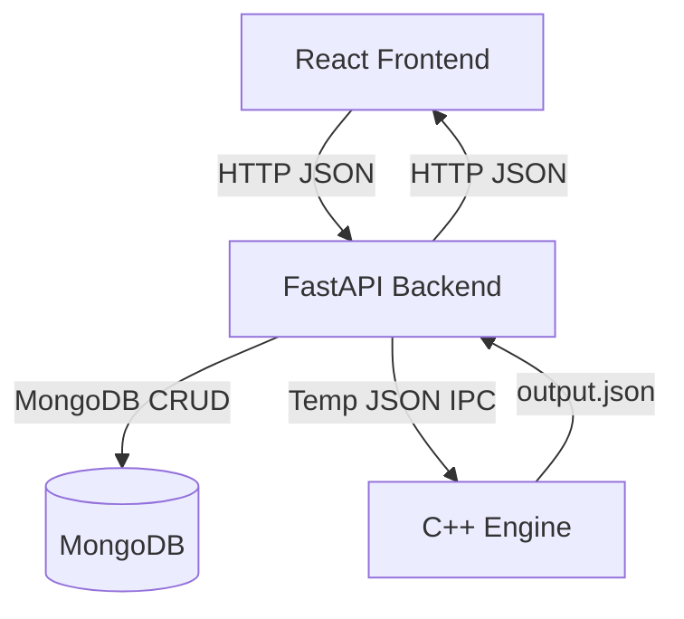

# Optimized Debt Settlement Engine

[](https://isocpp.org/std/the-standard)
[](https://fastapi.tiangolo.com/)
[](https://reactjs.org/)
[](https://www.docker.com/)
[](https://www.mongodb.com/)

## Overview

The Optimized Debt Settlement Engine minimizes group cash-flow transactions by combining a React frontend, FastAPI backend, MongoDB persistence, and a high-performance C++ core.

The system uses file-based IPC for C++ integration:
- Python serializes transactions to a temporary JSON file
- C++ engine reads the file, computes the optimized transactions, and writes `output.json`
- Python reads the output and returns it via the API

## System Architecture



## Algorithm Summary

The C++ engine uses a greedy max-heap cash flow minimization strategy:
1. Compute each participant's net balance from the raw transactions
2. Separate debtors and creditors into max-heaps by amount owed/owed-to
3. Repeatedly match the largest debtor against the largest creditor
4. Generate optimized settlement transactions until all balances are zero

This reduces the total transaction count while preserving the same net transfer amounts.

## Quick Start

### Requirements
- Docker
- Docker Compose

### Run locally with Docker

```bash
docker compose up --build
```

Then access:
- Frontend: `http://localhost:3000`
- Backend docs: `http://localhost:8000/docs`
- Backend health: `http://localhost:8000/health`

### Stop and remove containers

```bash
docker compose down
```

## Project Structure

```text
.
├── backend
│   ├── app
│   │   ├── api
│   │   │   └── v1
│   │   │       └── routes
│   │   │           ├── groups.py
│   │   │           └── optimize.py
│   │   ├── core
│   │   │   └── engine_bridge.py
│   │   └── models
│   │       ├── group.py
│   │       └── transaction.py
│   ├── tests
│   │   ├── conftest.py
│   │   └── test_api.py
│   ├── Dockerfile
│   └── main.py
├── core_engine
│   ├── build
│   │   └── debt_optimizer[.exe]
│   ├── include
│   │   └── optimizer.hpp
│   └── src
│       ├── main.cpp
│       └── optimizer.cpp
├── database
│   └── db_connection.py
├── frontend
│   ├── src
│   │   ├── api
│   │   │   └── client.js
│   │   ├── components
│   │   │   ├── DebtLedger.jsx
│   │   │   ├── GroupManager.jsx
│   │   │   └── TransactionForm.jsx
│   │   └── App.jsx
│   ├── Dockerfile
│   └── nginx.conf
├── docker-compose.yml
└── README.md
```

## Testing

From the repository root, run:

```bash
cd backend
pytest
```

## Deployment Guide

Start the application in production mode with:

```bash
docker compose -f docker-compose.prod.yml up -d --build
```

This deploys the React frontend on host port `80`, the FastAPI backend on an internal Docker network, and MongoDB with persistent storage.

> The GitHub Actions CI pipeline runs on every `push` and `pull_request` to `main`, and it validates the C++ engine build plus the FastAPI backend tests before changes are merged.

## Notes

- Production CORS is locked to standard local frontend origins
- The backend uses a global exception handler to return clean JSON errors
- The C++ binary path is resolved at runtime for Windows and Linux
